『[ドラゴンクエストXI 過ぎ去りし時を求めて](https://www.dq11.jp/)』を終えました。総プレイ時間は82時間、クエスト回収率は80%程度。ﾅｶﾞｶｯﾀﾖ……
感想としては「すごく良い話だった！」というのと、「すごく良くない話だった！」というのが半々。遊び終えた人の7割は色々と言いたくなる話でしょう。なので自分もここに書いておくにします。

なお、この記事はネタバレを大量に含むのであらかじめご留意ください。

<!--more-->

## 目次

<!-- toc -->

## 3行まとめ

- 序盤がとてもだるいが、中盤〜終盤にかけてのシナリオはシリーズ屈指の出来。だが……
- キャラクターがとても良い。特にベロニカ。
- 過ぎ去りし時なんて求めても仕方がない。

## すごく良いシナリオ

突然ですがドラクエの魅力って何だと思いますか。まぁ普通に考えると

- 堀井雄二氏の重厚なシナリオ
- 鳥山明氏の魅力的なキャラクターデザイン
- すぎやまこういち氏の音楽

という3点セットな訳ですよね。
この点、Ⅺは期待を裏切らないというか**ぶっちぎりで良い**。とても良い。過去シリーズと比べても非常に高い水準です。特にシナリオは最高峰じゃないでしょうか。

「暗い」「重い」と評されることの多い本作ですが、シリーズを通してもハードな部類でしょう。
元々ドラクエシリーズは明るい話が売りではなく、いきなり故郷が滅ぶⅣ、親が殺されて奴隷として青年期を過ごすⅤなど重めの作風です。

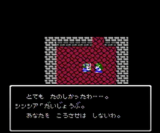
*山奥の村の悲劇（Ⅳ）*

そうしたシリーズの中でもⅪは重い。
Ⅺのストーリーをおさらいしましょう。まず主人公、冒頭でいきなり親と死別しますね。育ての親の遺言に従って王に会いに行ったら悪魔の子呼ばわりされ、そして~~案の定~~故郷の村が焼かれますね。主人公ありがちとはいえ苦しい。

とはいえハードな展開は一旦ここで一区切りとなり、その後はホムラの里で温泉に入ったり、サマディーのポンコツを助けたりしますよね。
~~個人的にはこの辺りが非常にだるい~~。そして徐々に仲間も揃い、序盤の山場である仮面武道会を制し、船に乗ってオーブ集めという王道展開に至る……

とはならないのが本作です。外海に出て始まる最初のイベント覚えてますか。人魚ロミアの恋ですね。事情が事情なので、どう進めても報われないロミアです。
本筋とは関係ないにも関わらず、ロミアとキナイの話は重い。

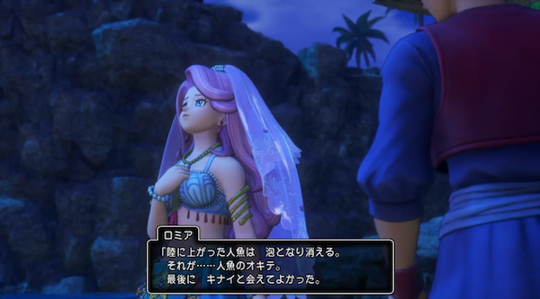
*ロミアに本当のことを話すかどうかが問題*

このイベントを境に本作品のシナリオの本質が見えてきます。
それは、「取り返しのつかないことにどう向き合っていくか」というものです。

## すごく良いキャラクター

さて異変後。Ⅺの本番であり、異変前にも若干漂っていた死の香りが一気に濃くなるのもここからです。
プレイヤーが目にするのは壊れているとしか形容できないフィールドと空。Ⅵにもはざまの世界とかありましたが、普通の世界がこうなってしまうのは本作だけです。

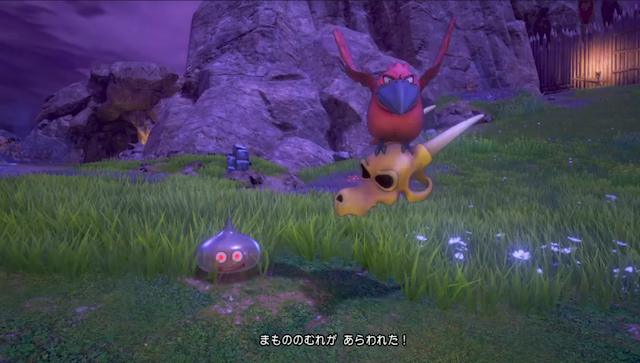
*何その配色？となるフィールド*

村人は死人続出。体感的には3分の1ぐらいが我が子を失った、親がいなくなったと悲嘆に暮れています。
特にひどいのはラムダの新婚夫婦。異変前に子供ができたと喜ばせておいて、異変後はしっかり殺すときちんと伏線を回収します。**鬼か。**
もう完全に取り返しがつかない状況です。

万事が万事そんな感じなので絶望している人も多いのですが、そこは勇者の話を描くドラゴンクエスト、仲間も含めてしっかり立ち向かっていく姿を描きます。
王の正体を見抜けなかったことに後悔しつつも主人公を支える決意をするグレイグ、人々を笑顔にするとパレードを始めるシルビア、モンスターと化した妹を前に苦悩するカミュ。
この辺りのエピソードは非常に完成度が高い。異変前のスイーツ食べ歩きとかやっていた頃とコントラストが際立っており、キャラクターの魅力が引き立っています。

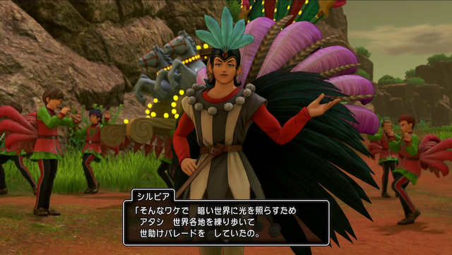
*Ⅺ屈指のイケメンである*

問題はいつまで経っても戻ってこないベロニカ。「記憶喪失のカミュをベロニカに見せたかった」とパーティ会話では言及されるし、不在の間も彼女用の装備は手に入るのですが、
片割れのセーニャが合流した直後にベロニカは既に死亡していたという事実が明らかになります。

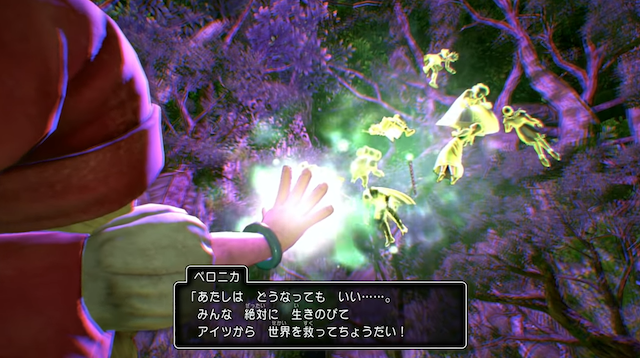
*なぜ全員無事だったのか？という疑問に対するアンサー*

これだけでも「は？」となる展開ですが、その後に行われることになるベロニカの葬儀も衝撃的。
ゲームで葬儀に参加するというのはなかなか異様な体験です。世界樹の葉とかそういう都合の良い展開にならずまったく「ドラゴンクエスト」的ではない。

ここまでこの作品は死別の悲しみに明け暮れる人々を念入りに描いてきました。それを今度はプレイヤーにも体験させる。要は制作者側はこう言いたい訳です、「お前も傍観者じゃなくて、当事者の一員やぞ」と。

一方のセーニャ。伏線になっていた始祖の森でのベロニカとの会話を後悔する姿に思わず涙した人は多いんじゃないでしょうか。
葬儀では毅然とした様子を見せたものの、ベロニカに依存気味だったセーニャが今後どうなってしまうのか不安もよぎります。

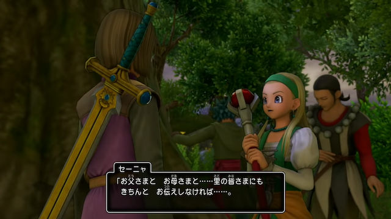
*気丈な振る舞いがかえって苦しい*

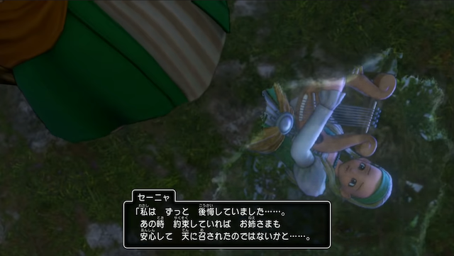
*水溜りに映る表情が泣きそうになっているのも辛い*

しかしセーニャは姉の死に向き合い、自分の髪を切って弔いとし姉の意思を受け継ぐ決意を見せます。セーニャは強かった。Ⅺのベストエピソードですね。
ゲームの上でもここから後のセーニャは異次元の強さになり、シルビアやロウをスタメン外にするポテンシャルを発揮してしまいます。

なお始祖の森でのベロニカとセーニャの会話ですが、この時のセーニャの表情尊いです。天使かよ。

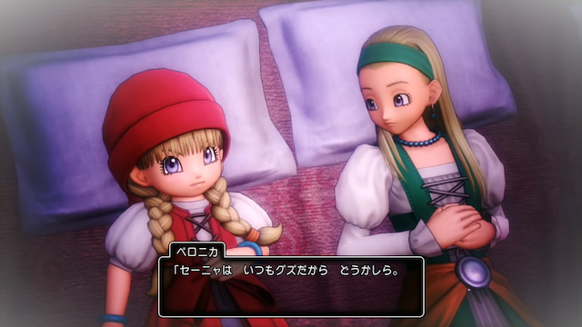
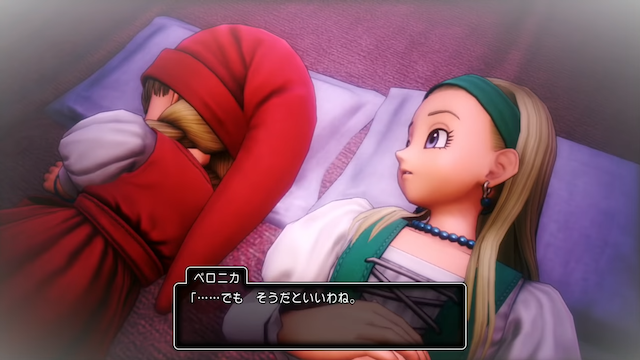
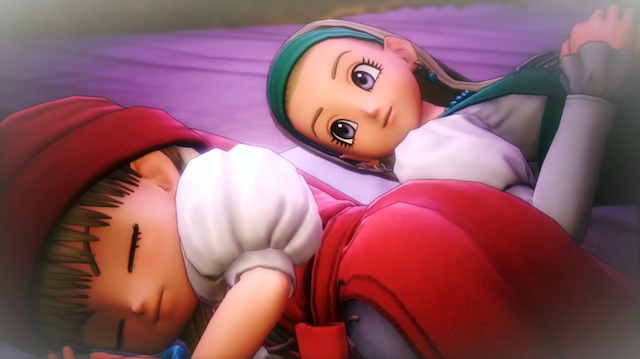

## すごく良くないご都合アイテム

さて、ここまでⅪを絶賛してきましたが、ここからはdisる部となります。Ⅺ好きな人は回れ右で。

天空魔城でウルノーガ倒しますよね。大樹が復活して世界が元に戻りますよね。万事が万事ハッピーエンドな訳ではないけれども良かったいい話だったな……と、
エンドロール見ながら余韻に浸っていると最後に不穏な文章が表示されますよね。**To be continued**と。

そこで思い出される本作のサブタイトル。「過ぎ去りし時を求めて」。ここで大多数の人は嫌な予感を覚えたと思うんですよ。
実際私も「**まさかそんなベタな話のはずがない**」と思ったんですが、先を進めるのが怖くて1ヶ月プレイ中断してしまいましたね。でも意を決して再開したんですよ。

そしたらやっぱり出てくるんですよね。「**時のオーブ**」とかいう**もう字面を見るだけで先の展開が読めるアイテム**。
ちなみにこのアイテム、異変前と異変後を含めて特に言及はなく、ゲームクリア〜大樹復活後に唐突に現れます。

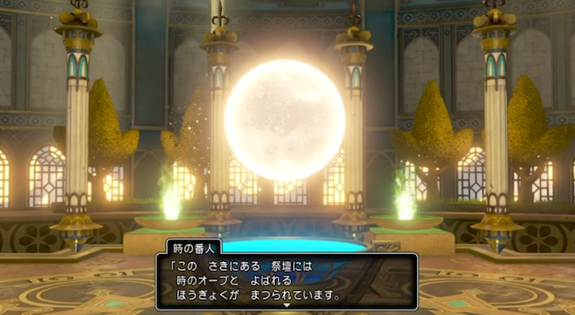
*出た瞬間「世界リセット落ちか！」と理解できてしまうアイテム*

で、この時のオーブを壊せるのは勇者だけで、勇者が壊すとアイテムを持って過去に戻れるとか、もうとにかく~~シナリオライターにとって~~非常に都合の良いアイテムであることが判明します。

あーはいはい、ってなりますよね。

## すごく良くないⅢ推し

で、お前を過去には行かせないとか仲間と茶番を繰り広げた後、結局過去に戻ってベロニカを助けにいく訳です。未来を変えるので仕方ないんですが、因縁を果たせずアホの子みたいに死んでいくホメロスが不憫。
当然異変後のイベントは全部なかったことになるのですが、シナリオ上やらないといけないやつは巻きの短縮版で雑に回収されていきます。カミュの妹とかシルビア親子の和解とか。

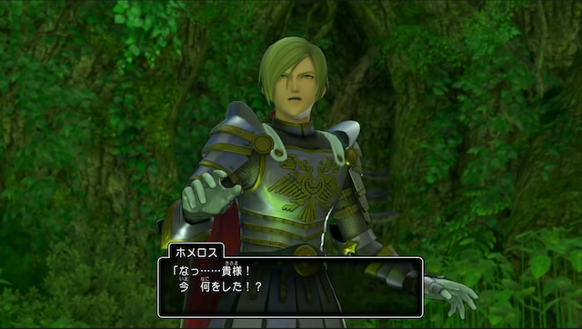
*ある意味一番の被害者かもしれない*

何というか覚悟を決めたセーニャも元に戻ってるし、ベロニカが生きててもなんだか全然嬉しくないし、そもそも異変後の世界に残った人たちはそのまんまだからこれ意味あるのか、となってしまい、
さっさと終わらないかなこのゲーム……とかそんな気分になります。

さてここでフィールドBGMが変わります。ドラクエⅢの「冒険の旅」です。
なぜここでこの曲を？となるのですが、ここを境に急激にⅢをままなぞったようなイベント・演出が増えます。

これは私見ですが、別に仮面武闘会やオーブ集めのような過去作のオマージュはいいと思うんです。
別に原作を知らなくても面白いし、原作を知っているとさらに楽しめるという要素なので。
でも「ときは来たれり」「おおぞらはおまえのもの」のようなものはやったらダメだと思うんです。これ原作知らないと意味不明なので**オマージュとして成立していない**んですよ。

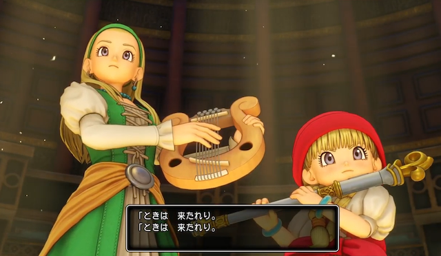
*ラーミア関係あります？*

Ⅺから入った人には意味不明だし、Ⅲやった私のような人でも「なんでここでその台詞？」となるので誰得感しかないのです。
**ぶっちゃけセーニャとベロニカがシナリオライターに喋らされてる感が強い**ので、私はわりと好きではないです。むしろ（省略）

極め付けはラスボス戦で使うことになる「勇者の剣・真」。これを使うとラスボスの纏っている闇の衣を剥ぐことができ、真の戦いが始まるという展開です。
**これはⅢの話ではなく、Ⅺの話です**。第三部はⅢ焼き直しのオンパレードですが、最後の最後まで同じというのは驚愕しました。悪い意味で。

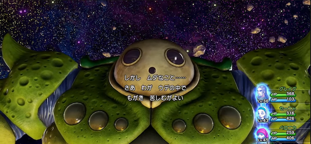
*展開も台詞も四半世紀前に見たやつ*

こうした過去作と重ねる演出は、やっても1〜2回が限度だと思うんですよね。
こうくどいと「またこれか」「さっきまでⅪやってたのになぁ」という気分になってしまって…

## 最後に

過ぎ去りし時なんて求めても仕方がない。ドラクエは後ろを振り返らないで欲しい。

時のオーブは砕かずにそっとしておきましょう。
